# lifeos-template

[](https://opensource.org/licenses/MIT)
[](https://docs.claude.com/en/docs/claude-code/overview)
[](https://developers.openai.com/codex/cli)
[](https://github.com/huasan2025/lifeos-template/tags)

> 🌐 **中文版**: [README.md](./README.md)

<p align="center">
  
</p>

> A personal OS template with **your own AI assistant + a self-evolution mechanism**. One `npx` command, 10 minutes to have your own version.

Not a knowledge base. Not a second brain. It's a **decision-serving** personal & project OS — helps you focus on the real strategic problems and tie daily execution to long-term bets.

---

## Why I built this

I started building this personal OS in January 2026. It went through **5 complete rewrites** — each one because I realized the structure still wasn't serving my actual decisions well enough. Now it works smoothly, so I decided to open-source it.

It solves a few very real problems for me:

- **No more 15-minute morning ritual of figuring out "where to start"** — `/go` is one command. The AI reads my state and tells me the 3 things I should do today.
- **I need an AI assistant that actually knows me** — not limited by ChatGPT's web context window, not dependent on opaque memory systems. All context lives in Obsidian files I can see, edit, and track in git.
- **I want "process as content" for real** — focus my time and energy on building products. The process of doing the work naturally becomes article and video material, no need to carve out separate "content creation" time.

There's more — self-evolution mechanism, cross-project reuse, the hard ≤3 Problems constraint, etc. The full story unfolds as I keep writing.

<p align="center">
  
</p>

I still use HuaSan-LifeOS every day. lifeos-template is its shareable version.

---

## What you get

Open Claude Code (or Codex CLI), type `/go`, and your AI assistant immediately tells you **the 3 things you should do today**.

Not because it read your todo list — because it remembers:
- Who you are, what you're doing, where you're stuck
- Your ≤3 strategic problems, your current main project
- Where you left off last session, what traps you hit, what's next

No need to re-explain yourself every new session.

---

## 5 core values

### 1. Your own AI assistant (you name it, you define its personality)

Run `/init-life-os` once, walk through a 4-step interview, and you get your AI assistant:

- Pick a name you like (Chinese / English / anything)
- Pick a style: warm vs. rational, proactive vs. quiet
- Its role and behavior contracts all go into `90-System/Soul.md`, editable anytime

Not a wrapper — the AI actually responds in that persona.

### 2. One command to start the day: `/go`

```
You: /go
AI: Last time you stopped at the Y problem in project X, pivoted to plan Z.
    3 things today:
    1. Ship tweet #2 + demo (W1 deadline is 9 days out)
    2. DM 3-5 users for trial (48h feedback window)
    3. Business reps: dissect 1 product + 1 landing (45 min)
    Which one first?
```

The AI reads your Identity / Soul / PROGRESS — it judges from **your actual state**, not from thin air.

### 3. AI self-evolution mechanism (`91-Assistant/`)

This is what makes this template special — **the AI learns from being corrected by you**.

Every time you say "no, it should be...", the AI:
1. Acknowledges (no defense)
2. Attributes the cause (insufficient info? judgment error? role mismatch?)
3. Writes the rule into `91-Assistant/Evolution Rules.md` → "behavior corrections list"

Next session it reads this file automatically — **the corrections take effect**. You don't have to teach the AI the same lesson twice.

### 4. Problem → Project → Library 3-tier model

<p align="center">
  
</p>

- **≤3 hard cap**: more than that means you haven't converged to real bets yet
- **Every Project must anchor to a Problem** (enforced via bidirectional link): prevents "did a lot, don't know why"
- **Library doesn't pile up**: distinguished by frontmatter `type`, no subdirectory bloat

### 5. Process is content

Notes, article drafts, video scripts from project execution — **all stay in the project directory**.

No separate "Outputs" folder. Doing the work produces the content. High-quality pieces get a ceremonial entry added to `00-Dashboard/Published.md` — keeping the ship vibe without over-engineering.

---

## Directory structure

```
lifeos-template/
├── 00-Dashboard/        Daily entry point (Published.md cross-cuts shipped work)
├── 02-Problems/         Long-term strategic problems (≤3)
│   └── EXAMPLE-Problem.md    Example, delete after reading
├── 03-Projects/         Problem-solving containers
│   └── example-project/      Example project, delete after reading
│       ├── process/          Execution notes
│       └── articles/         Content produced along the way
├── 04-Library/          Cross-project reusable assets
│   ├── EXAMPLE-howto.md
│   ├── EXAMPLE-insight.md
│   ├── EXAMPLE-decode.md
│   └── EXAMPLE-analysis.md
├── 90-System/           System-level mechanics
│   ├── Identity.md           Who you are (generated by onboarding)
│   ├── Soul.md               AI assistant's persona (generated by onboarding)
│   ├── Commands.md           Command reference
│   └── PROGRESS-ARCHIVE.md   Old progress archive
├── 91-Assistant/         AI assistant's evolution mechanism (renamed to 91-<your-assistant-name> after onboarding)
│   ├── Evolution Rules.md    Self-evolution rules + behavior corrections list
│   ├── Growth Log.md         What I learned
│   └── Observations.md       What I observed
├── 99-Archive/          Cold storage (AI doesn't read by default)
├── .claude/commands/    5 core commands
│   ├── init-life-os.md       Onboarding
│   ├── go.md                 Restore context
│   ├── today.md              Today's focus
│   ├── save.md               Save progress + AI self-check
│   └── capture.md            Extract writing material
├── CLAUDE.md            Claude Code entry
├── AGENTS.md            Codex CLI entry (same content as CLAUDE.md)
└── PROGRESS.md          Current progress (updated each /save)
```

---

## 5 core commands

| Command | One-liner | When to use |
|---|---|---|
| `/init-life-os` | 4-step interview generates Identity + Soul + placeholder replacement | Once after fresh vault init |
| `/go` | Reads PROGRESS, tells you what to continue today | Every session start |
| `/today` | Based on Identity/Soul/PROGRESS, judges the 1-3 most important things today | When you want a deeper take |
| `/save` | Save progress + AI self-check (write Growth Log / update behavior corrections) | Before `/clear` |
| `/capture` | Extract writing material from conversation, lands in current project's `process/` | When the conversation surfaces something worth keeping |

<p align="center">
  
</p>

---

## Quick start (3 steps)

**Prereq:** Node.js (most developers have it) and [Claude Code](https://docs.claude.com/en/docs/claude-code/overview) or [Codex CLI](https://developers.openai.com/codex/cli).

### 1. Initialize your vault with one command

```bash
npx degit huasan2025/lifeos-template my-vault
cd my-vault
```

`degit` is a mature tool maintained by Vercel — it does a **clean clone** of the template content into `my-vault/` (no upstream git history, you start fresh). Rename `my-vault` to whatever you want.

> Want git versioning + backup? After clone, run `git init` and push to your own private repo.
> Want to fork upstream so you can sync future updates? Use the classic `git clone https://github.com/<your-username>/lifeos-template.git my-vault` instead.

### 2. Launch AI assistant + run onboarding

Enter the directory and start your AI runtime (pick one):

```bash
claude    # Claude Code
codex     # Codex CLI
```

In the AI prompt, type:

```
/init-life-os
```

Walk through the 4-step interview:
1. **5-dimension info gathering** — AI gets to know you (identity / capabilities / blockers / goals / constraints)
2. **AI assistant naming + personality choice** — AI gives you 3 candidates, pick 1 or do your own
3. **Command selection** (defaults to keep all)
4. **Writing style** (defaults to skip)

10-30 minutes (depends on how much you dump).

### 3. Start using it

```
/go
```

The AI reads your Identity / Soul / PROGRESS and tells you what to do today.

---

## No Claude Code / Codex? Still works

`.claude/commands/*.md` are just prompt files. Copy-paste their content into any AI chat (ChatGPT / Claude.ai / Gemini / local LLMs), tell the AI "follow this prompt to guide me" — it runs the same way.

You just don't get the `/go` shortcut — you'll need to paste the prompt + current vault content each time.

---

## Design principles

- **Problems ≤ 3**: strategic problems are hard-capped. More means you haven't converged to real bets.
- **Process is content**: project outputs stay in the project, no separation.
- **Git is the trash bin**: delete directly, no soft-delete layer on top of git.
- **AI doesn't read 99-Archive by default**: cold storage doesn't pollute context.
- **AI doesn't write to vault unless asked**: explicit only.

---

## Roadmap

- **v0.1** (current): onboarding skill + template vault + 5 core commands
- **v0.2**: command selection interaction, built-in writing style packs (incl. open-source styles like khazix-writer)
- **v1.0**: Web-based onboarding (no CC/Codex required)

---

## Feedback

- [Issues](https://github.com/huasan2025/lifeos-template/issues)

## License

MIT
