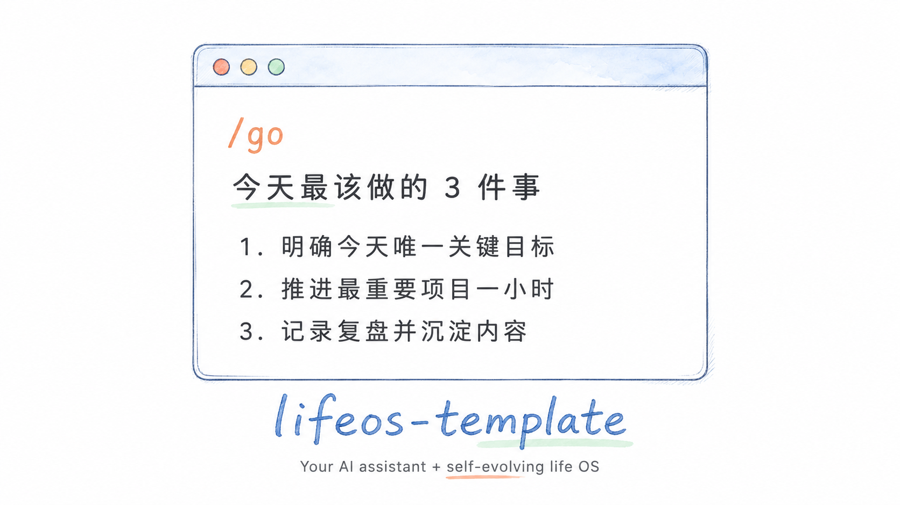
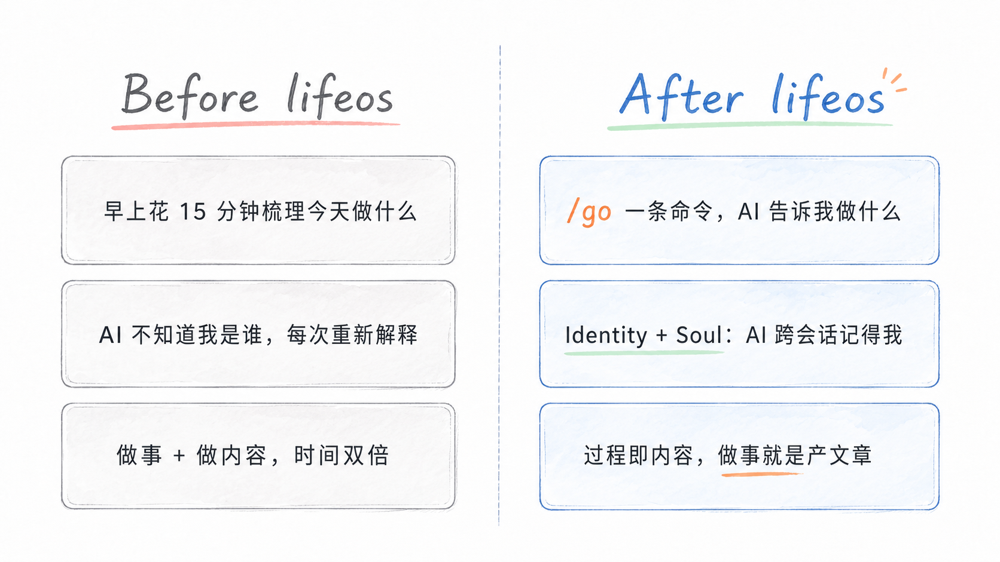
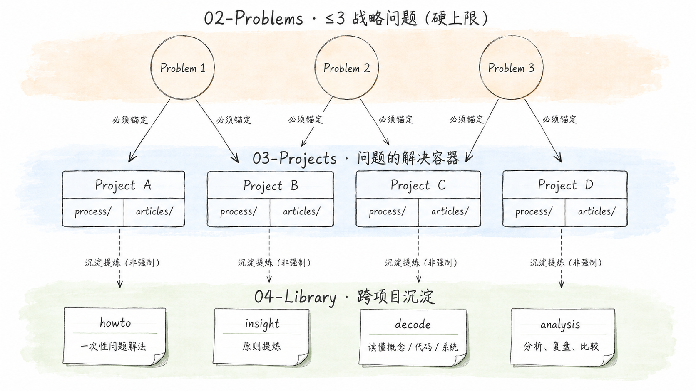
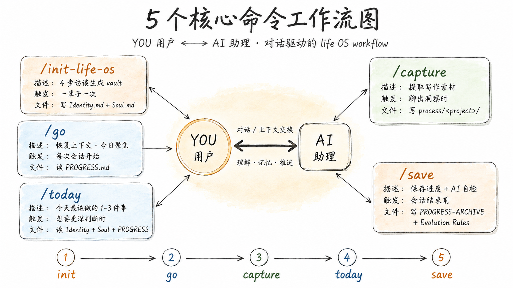

# lifeos-template

[](https://opensource.org/licenses/MIT)
[](https://docs.claude.com/en/docs/claude-code/overview)
[](https://developers.openai.com/codex/cli)
[](https://github.com/huasan2025/lifeos-template/tags)

> 🌐 **English version**: [README.en.md](./README.en.md)

<p align="center">
  
</p>

> 一个**有专属 AI 助理 + 自我进化机制**的个人操作系统模板。一行 `npx` 命令，10 分钟拥有你自己的版本。

不是知识库，不是第二大脑。是一个**服务现实决策**的人生与项目操作系统——帮你聚焦真正的战略问题，把日常推进绑在长期赌注上。

---

## Why I built this

我从 2026 年 1 月开始构建这套个人 OS。中间**彻底重构过 5 轮**——每次重构都是因为发现"这个结构还不够服务我真正的决策"。到现在用着越来越顺手，所以决定把它开源。

它解决我几个非常实际的问题：

- **每天开始工作前不再花 15 分钟梳理"从哪开始"** —— `/go` 一条命令，AI 读完我的状态告诉我今天最该做的 3 件事。
- **我需要一个真正了解我的 AI 助理** —— 不受 ChatGPT 网页那种上下文限制，也不依赖黑盒的记忆系统。所有上下文都在 Obsidian 文件里，我可见、可改、可 git 追溯。
- **我想真正实现"过程即内容"** —— 把时间精力聚焦在构建产品上，让做事的过程自然变成文章和视频素材，不用专门腾时间"做内容"。

还有其他——比如自我进化机制、跨项目复用、Problem ≤3 的硬约束等等。完整故事会陆续写出来。

<p align="center">
  
</p>

我每天还在用 HuaSan-LifeOS。lifeos-template 是它的可分享版本。

---

## 你能拿到什么

打开 Claude Code（或 Codex CLI），输入 `/go`，AI 助理立刻告诉你**今天最该做这 3 件事**。

不是因为它读了你的 todo list——是因为它记得：
- 你是谁、在做什么、瓶颈在哪
- 你的 ≤3 个战略问题、当前主项目
- 上次会话停在哪、踩了什么坑、下一步是什么

不需要每次开新会话重新解释一遍自己。

---

## 5 个核心价值

### 1. 专属 AI 助理（你给它取名、定义人格）

跑一次 `/init-life-os`，4 步访谈生成你的 AI 助理：

- 取一个你喜欢的名字（中文/英文都行）
- 选风格：温暖 vs 理性，主动反问 vs 安静陪伴
- 它的角色、行为约定全部写进 `90-System/Soul.md`，你随时能改

不是套壳——而是 AI 真的按这个人格响应你。

### 2. 一个命令开始今天：`/go`

```
你: /go
AI: 上次你停在 X 项目的 Y 问题，已 PIVOT 到 Z 方案。
    今天 3 件事：
    1. 发推文 #2 + demo（W1 生死线还差 9 天）
    2. 找 3-5 个用户私聊试用（48h 反馈窗）
    3. 业务基本功：拆 1 产品 + 1 landing（45 min）
    今天先做哪件？
```

AI 读了你的 Identity / Soul / PROGRESS，从**你的实际状态**判断，不是从空气里。

### 3. AI 自我进化机制（91-Assistant/）

这是这个模板最特别的地方——**AI 会从被你纠正的错误中学习**。

每次你说"不对，应该是..."，AI 会：
1. 承认（不辩解）
2. 归因（错在哪：信息不足？判断偏差？角色越位？）
3. 把规则写进 `91-Assistant/Evolution Rules.md` 的"行为修正清单"

下次会话开始时，AI 自动读这个文件，**这些纠正立即生效**。你不用反复教 AI 同样的事。

### 4. Problem → Project → Library 三层模型

<p align="center">
  
</p>

- **≤3 硬上限**：超出说明还没收敛到真正的战略赌注
- **每个 Project 必须锚定一个 Problem**（双链强制）：防止做了一堆事但不知道为什么
- **Library 不堆积**：用 frontmatter type 区分，不开子目录

### 5. 过程即内容

项目过程中写的笔记、文章稿、视频稿——**全部留在项目目录里**。

没有专门的 "Outputs" 目录。做事本身就在产内容。完成度高的内容手动加到 `00-Dashboard/Published.md` 顶部，保留 ship 的仪式感。

---

## 目录结构

```
lifeos-template/
├── 00-Dashboard/        当天操作入口（Published.md 已发布作品索引）
├── 02-Problems/         长期战略问题（≤3）
│   └── EXAMPLE-Problem.md    示范文件，看完可删
├── 03-Projects/         问题的解决容器
│   └── example-project/      示范项目，看完可删
│       ├── process/          执行过程笔记
│       └── articles/         过程中产出的内容
├── 04-Library/          跨项目复用资产
│   ├── EXAMPLE-howto.md
│   ├── EXAMPLE-insight.md
│   ├── EXAMPLE-decode.md
│   └── EXAMPLE-analysis.md
├── 90-System/           系统级机制
│   ├── Identity.md           你是谁（onboarding 生成）
│   ├── Soul.md               AI 助理人格（onboarding 生成）
│   ├── Commands.md           可用命令说明
│   └── PROGRESS-ARCHIVE.md   旧进度归档
├── 91-Assistant/         AI 助理的进化机制（onboarding 后重命名为 91-<你的助理名>）
│   ├── Evolution Rules.md    自我进化规则 + 行为修正清单
│   ├── Growth Log.md         学到了什么
│   └── Observations.md       观察到了什么
├── 99-Archive/          冷库（AI 默认不读）
├── .claude/commands/    5 个核心命令
│   ├── init-life-os.md       onboarding
│   ├── go.md                 恢复上下文
│   ├── today.md              今日聚焦
│   ├── save.md               保存进度 + AI 自检
│   └── capture.md            提取写作素材
├── CLAUDE.md            Claude Code 入口
├── AGENTS.md            Codex CLI 入口（内容同 CLAUDE.md）
└── PROGRESS.md          当前进度（每次 /save 更新）
```

---

## 5 个核心命令

| 命令 | 作用 | 何时用 |
|---|---|---|
| `/init-life-os` | 4 步访谈生成 Identity + Soul + 占位符替换 | 初始化 vault 之后跑一次 |
| `/go` | 读 PROGRESS 告诉你今天能继续做什么 | 每次会话开始 |
| `/today` | 基于 Identity/Soul/PROGRESS 判断今天最值得做的 1-3 件事 | 想要更深一层判断时 |
| `/save` | 保存进度 + AI 自检（写 Growth Log / 更新行为修正清单） | /clear 前用 |
| `/capture` | 从对话中提取写作素材，落到当前项目的 process/ | 对话聊出东西时 |

<p align="center">
  
</p>

---

## 快速开始（3 步）

**前置：** 装好 Node.js（开发者通常都有）和 [Claude Code](https://docs.claude.com/en/docs/claude-code/overview) 或 [Codex CLI](https://developers.openai.com/codex/cli)。

### 1. 一行命令初始化 vault

```bash
npx degit huasan2025/lifeos-template my-vault
cd my-vault
```

`degit` 是 Vercel 维护的成熟工具，会**干净 clone**模板内容到 `my-vault/`（不带上游 git 历史，给你一个干净起点）。`my-vault` 改成你想要的目录名即可。

> 想要 git 版本管理 + 备份？clone 完后自己 `git init` + push 到你的 private repo。
> 想 fork 上游 repo 以便未来同步更新？也可以用经典 `git clone https://github.com/<你的用户名>/lifeos-template.git my-vault`。

### 2. 启动 AI 助理 + 跑 onboarding

进入目录后启动 AI runtime（任选其一）：

```bash
claude    # Claude Code
codex     # Codex CLI
```

在 AI 对话框输入：

```
/init-life-os
```

跟着 4 步访谈走：
1. **5 维度信息挖掘**——AI 了解你（身份/能力/瓶颈/目标/约束）
2. **AI 助理命名 + 人格选择**——AI 给你 3 个候选，选 1 或自己来
3. **命令保留选择**（默认全留）
4. **写作风格选择**（默认跳过）

10-30 分钟（取决于你愿意 dump 多少信息）。

### 3. 开始用

```
/go
```

AI 会读你的 Identity / Soul / PROGRESS，告诉你今天最该做什么。

---

## 没装 Claude Code / Codex 也能用

`.claude/commands/*.md` 本身就是 prompt 文件。把内容复制粘贴到任何 AI 对话框（ChatGPT / Claude.ai / Gemini / 国内大模型），告诉 AI："请按这个 prompt 引导我"——同样能跑。

只是没有 `/go` 这种快捷方式，需要每次手动粘贴 prompt + 当前 vault 文件内容。

---

## 设计原则

- **Problems ≤ 3**：战略问题硬上限。超出说明还没收敛到真正赌注
- **过程即内容**：项目产出物留项目里，不分流
- **Git 是回收站**：删除直接删，不在 git 之上造软删除
- **AI 默认不读 99-Archive**：冷库不污染上下文
- **AI 不主动往 vault 写笔记**：除非明确要求

---

## 路线图

- **v0.1**（current）：onboarding skill + 模板 vault + 5 核心命令
- **v0.2**：命令选择交互、写作风格预设包
- **v1.0**：Web 表单 onboarding（无需装 CC/Codex）

---

## 反馈

- [Issues](https://github.com/huasan2025/lifeos-template/issues)

## License

MIT
